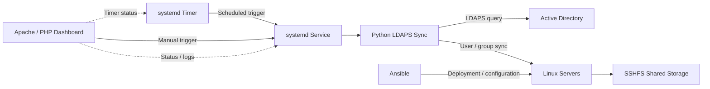

# Midtbyen AD Sync

Automated identity synchronization and Linux server provisioning using
Active Directory, Python, LDAPS, Ansible and systemd.

> **Student project:** This solution was developed as part of my final project
> in IT Operations at TISIP Fagskole. The environment was designed as a
> learning/lab environment and is not intended to be production-ready.

## Overview

The goal of the project was to create a centralized IT environment where
Active Directory acts as the authoritative source for users and groups,
while Linux servers automatically synchronize identity data from AD.

A Python-based synchronization service queries Active Directory over LDAPS 
and synchronizes users and group memberships to the Linux servers.
The synchronization runs automatically using a systemd service and timer.

Ansible is used to automate deployment and configuration of the Linux
environment.

## Architecture



## Key Features

- Active Directory as the authoritative identity source
- Automated user and group synchronization using Python and LDAPS
- Scheduled synchronization using systemd
- Automated server configuration and deployment with Ansible
- Linux firewall configuration using UFW
- Shared storage using SSHFS
- Apache/PHP status dashboard
- CI with GitHub Actions (`ansible-lint`, `yamllint`, `checkov`)

## Technologies

- Windows Server / Active Directory
- Linux
- Python (`ldap3`)
- LDAPS
- Ansible
- systemd
- Bash
- Apache / PHP
- SSHFS
- UFW

## Project Structure

```text
playbooks/     # Ansible playbooks
files/         # Service files, templates and sync.py
web/           # PHP dashboard
inventory/     # Ansible inventory
```

## Main playbooks
```text
01-create-ansible-user.yml
02-setup-ad-sync.yml
03-setup-ad-sync-systemd.yml
04-setup-fileserver.yml
05-setup-ufw.yml
06-deploy-web.yml
07-setup-websync.yml
```
## What I Worked On

My main focus was automation and integration between Active Directory and the Linux environment. This included developing the Python synchronization logic, configuring LDAPS communication, automating execution with systemd and using Ansible to deploy and configure services.

The project also involved troubleshooting networking, DNS, authentication, permissions and service dependencies across Windows and Linux systems.

## Known Limitations

This was developed as a student project and several areas would need to be improved before using a similar solution in production.

Examples include:

- Improved secrets and credential management
- More extensive error handling and monitoring
- More extensive automated testing beyond linting and static analysis
- Automated deployment / continuous delivery
- More robust rollback and recovery mechanisms
- Improved scalability and high availability
- Password synchronization/provisioning was not fully implemented

## What I Learned

The project gave me practical experience with integrating Windows and Linux environments, infrastructure automation, troubleshooting systems and documenting technical solutions.

It also highlighted the importance of idempotent automation, secure credential handling, monitoring and designing systems with failure scenarios in mind.

## Deployment

Run playbooks in order:
```bash
ansible-playbook -i inventory/hosts.ini playbooks/01-create-ansible-user.yml --ask-become-pass
ansible-playbook -i inventory/hosts.ini playbooks/02-setup-ad-sync.yml
ansible-playbook -i inventory/hosts.ini playbooks/03-setup-ad-sync-systemd.yml
ansible-playbook -i inventory/hosts.ini playbooks/04-setup-fileserver.yml
ansible-playbook -i inventory/hosts.ini playbooks/05-setup-ufw.yml
ansible-playbook -i inventory/hosts.ini playbooks/06-deploy-web.yml
ansible-playbook -i inventory/hosts.ini playbooks/07-setup-websync.yml
```
